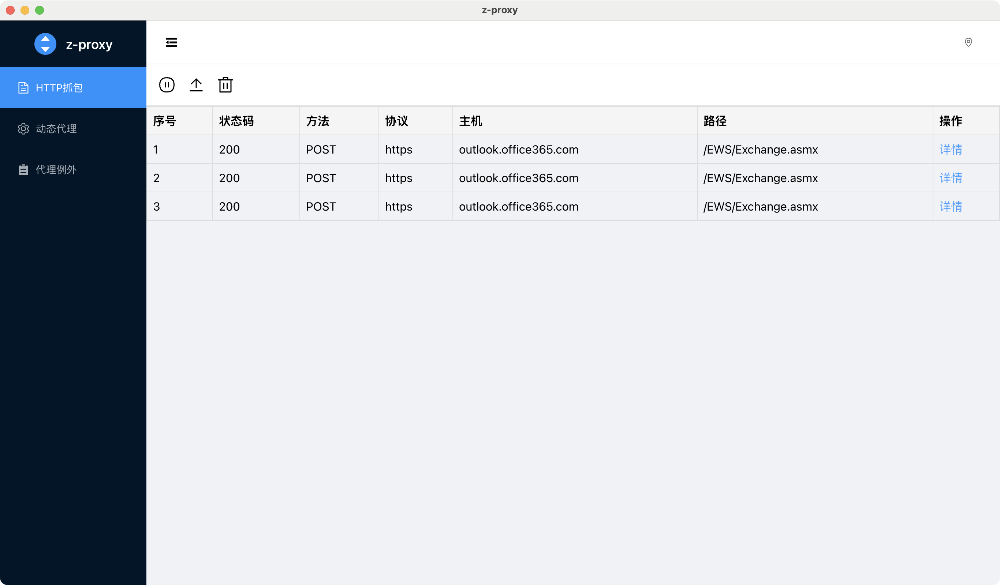
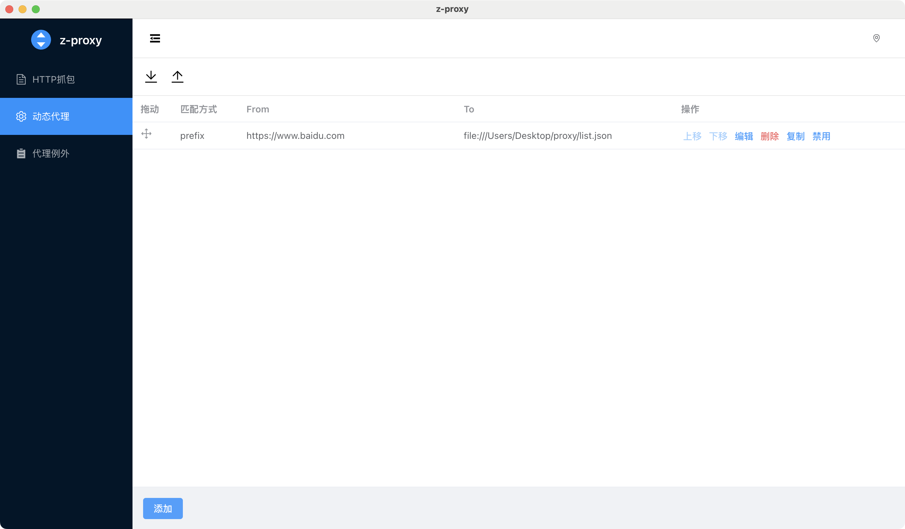
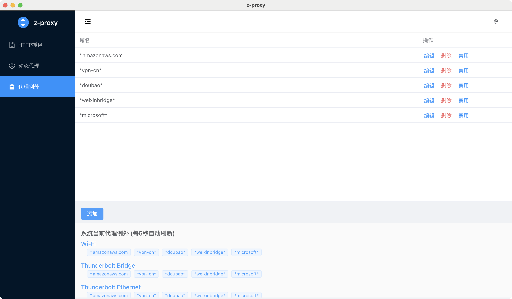

# Z-Proxy 用户使用手册

## 简介

Z-Proxy 是一个轻量级的面向Web开发者的 HTTP(S) 代理抓包工具，用于监听和分析网络请求、修改网络请求或响应。

**主要功能**:
- 监听和查看网络请求
- 修改请求/响应进行测试
- 替换本地资源进行开发
- 模拟网络延时进行性能测试

---

## 安装

### 系统要求
- macOS 10.13+ 或 Windows 7+
- 管理员权限

### macOS 安装

1. 下载 `.dmg` 文件并打开
2. 将 Z-Proxy 拖到"应用程序"文件夹
3. 双击启动应用
4. 信任证书：打开"钥匙串访问" → 搜索 "anyproxy" → 双击证书 → 设置为"始终信任"
5. 重启应用

### Windows 安装

1. 解压 `z-proxy.zip` 到合适位置
2. 双击 `z-proxy.exe` 启动
3. 信任证书：按 `Win + R` → 输入 `certmgr.msc` → 在"受信任的根证书颁发机构"中导入 `rootCA.crt`
4. 重启应用

---

## 基本使用

### 界面布局

### HTTP 抓包

1. 应用启动后自动开始监听
2. 打开浏览器或其他应用程序访问网站
3. 所有请求会显示在列表中
4. 点击请求查看详情

### 暂停/恢复监听

点击"暂停"按钮可暂停监听，再次点击恢复

---

## 动态代理

动态代理的目的是对特定的网络请求进行拦截、修改。支持把请求路由到其他站点或者路由到本地文件，也可以通过JS代码修改请求或者响应。

### 添加规则

1. 点击"动态代理" → "添加"
2. 配置匹配条件：
   - **Exact**: 完全相同的 URL
   - **Prefix**: URL 的前缀包含当前配置的字符串
   - **Regex**: 配置的字符串可以包含正则表达式的相关符号，URL 通过正则表达式进行匹配

3. 选择代理类型：
   - **HTTP/HTTPS**: 使用其他服务的 URL 的资源
   - **File**: 使用本地文件替换响应
   - **Har**: 使用本地的 har 文件，找到每个请求在 har 中请求一致的记录，使用 har 中的响应返回
   - **延时模拟**: 模拟网络延时（毫秒）
   - **修改请求**: 通过 JS 代码修改请求参数
   - **修改响应**: 通过 JS 代码修改服务器返回的数据
4. 保存

## 代理例外
有一些服务如果通过代理无法正常访问，或者有些服务请求过多，占用太多的代理资源。
可以在这里配置不希望被代理的域名，支持统配符。

---

## 常见问题

| 问题 | 解决方案 |
|------|--------|
| 没有看到请求 | 确认应用已启动，打开浏览器访问网站，检查系统代理设置，确保 HTTP 和 HTTPS 的代理都设置成了127.0.0.1:8000 |
| HTTPS 请求显示错误 | 需要信任证书（见安装部分） |
| 代理规则不生效 | 确认规则已启用，检查匹配条件，刷新浏览器 |
| 内存占用过高 | 清空请求记录，删除不需要的规则，重启应用 |
| 无法设置系统代理 | 确保有管理员权限，检查网络设置 |
| 某些网站 / 程序无法访问 | 部分网站和程序无法被代理，需要配置代理例外，排除这些域名 |

---

## 故障排除

### 应用无法启动

**macOS**:
- 检查系统版本（需要 10.13+）
- 重新下载应用
- 重启计算机

**Windows**:
- 检查系统版本（需要 7+）
- 以管理员身份运行
- 重新下载应用

### 无法设置系统代理

**macOS**:
- 确保有管理员权限
- 手动设置：系统偏好设置 → 网络 → 高级 → 代理
- 设置 HTTP/HTTPS 代理为 `127.0.0.1:8000`

**Windows**:
- 以管理员身份运行应用
- 手动设置：设置 → 网络和 Internet → 代理
- 启用手动代理设置，地址 `127.0.0.1`，端口 `8000`

### 应用崩溃

1. 清空请求记录
2. 删除不需要的规则
3. 重启应用
4. 重启计算机

---

## 性能建议

- 定期清空请求记录
- 避免过于复杂的匹配条件
- 每天重启一次应用

---

## 安全建议

- 不要在公共网络上使用
- 定期清空请求记录
- 不要在规则中存储敏感信息
- 及时更新应用

---

**最后更新**: 2025 年 12 月 31 日

**版本**: v0.2.1

**支持平台**: macOS 10.13+ 和 Windows 7+
